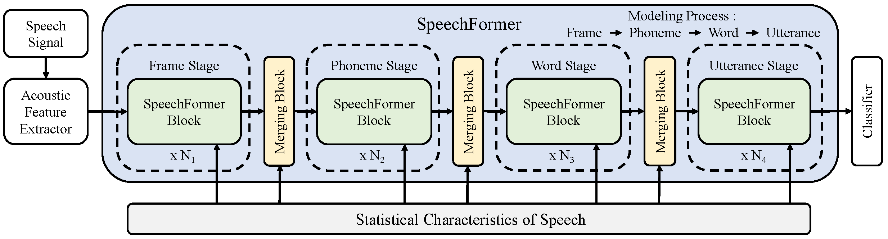

# Framework: SpeechFormer

Paper：SpeechFormer: A Hierarchical Efficient Framework Incorporating the Characteristics of Speech

# Prepare data
## Download datasets
* Speech emotion recognition: [IEMOCAP](https://sail.usc.edu/iemocap/index.html), [MELD](https://affective-meld.github.io/)  
* Alzheimer’s disease detection: [Pitt](https://dementia.talkbank.org/)  
* Depression classification: [DAIC-WOZ](https://dcapswoz.ict.usc.edu/)  

Note that you should create a metadata file (`.csv` format) for each dataset to record the `name` and `label` of the samples. Then modify the arguments: `meta_csv_file` in `./utils/dataset.py` according to the absolute path of the `.csv` file.

## Extract acoustic feature
* Three acoustic features are extracted from each audio sample, including `spectrogram (Spec)`, `Log-Mel spectrogram (Logmel)` and `pre-trained Wav2vec`.  
* Each extracted feature is saved in `.mat` format using `scipy`.  
* The pre-trained wav2vec model is publicly available at [here.](https://github.com/pytorch/fairseq/blob/main/examples/wav2vec)
```
python ./extract_feature/extract_spec.py
python ./extract_feature/extract_logmel.py
python ./extract_feature/extract_wav2vec.py
```

# Train model

